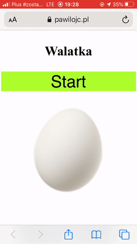

# Walatka
## Na wybitki

Very simple game for Easter.

HTML + Javascript + PHP

### Zasady
W czasie świątecznych biesiad do zabaw wykorzystywano pisanki i kraszanki.
Najczęściej były to gry zwane walatką lub wybitką, czy też zabawą na wybitki.
Polegała ona na toczeniu po stole pisanek albo stukanie się pisankami trzymanymi w ręku.
Wygrywał ten, czyja pisanka się nie rozbiła.

Po naciśnięciu guzika 
 Start, złap mocno telefon i zamachnij się jak jajkiem!
